        # Блок-схема верхнего уровня программы управления замком

## Основной алгоритм работы программы

```mermaid
flowchart TD
    Start([Старт программы]) --> Init[Инициализация системы]
    
    Init --> InitHD[Инициализация периферии:<br/>HD_System_Init<br/>HD_Delay_Init<br/>HD_Timer1_Init]
    InitHD --> InitComponents[Инициализация компонентов:<br/>LED_Init<br/>Buttons_Init<br/>Keyboard_Init<br/>SEG7_Init]
    InitComponents --> SetState[Установка начального состояния:<br/>STATE_LOCKED]
    SetState --> MainLoop[Основной цикл while 1]
    
    MainLoop --> ReadKeypad[Чтение клавиатуры<br/>keypadRead]
    ReadKeypad --> CheckKey{Клавиша<br/>нажата?}
    
    CheckKey -->|Да| ProcessKeypad[Обработка клавиатуры<br/>process_keypad]
    CheckKey -->|Нет| ProcessButton
    
    ProcessKeypad --> CheckLock{Клавиатура<br/>заблокирована?}
    CheckLock -->|Да| CheckTimeout{Таймаут<br/>истек?}
    CheckTimeout -->|Да| UnlockKeypad[Разблокировка клавиатуры]
    CheckTimeout -->|Нет| ProcessButton
    UnlockKeypad --> ProcessButton
    CheckLock -->|Нет| ProcessKeyState[Обработка по состоянию системы]
    
    ProcessKeyState --> StateSwitch{Состояние<br/>системы?}
    
    StateSwitch -->|STATE_LOCKED| LockedInput[Ввод кода разблокировки:<br/>- Добавление символа в буфер<br/>- Отображение на дисплее<br/>- Проверка на 20 символов<br/>- Проверка кода при 6 символах]
    
    StateSwitch -->|STATE_UNLOCKED| UnlockedInput[Клавиатура неактивна]
    
    StateSwitch -->|STATE_PROGRAMMING| ProgrammingInput[Ввод нового кода:<br/>- Добавление символа в буфер<br/>- Отображение на дисплее<br/>- Сохранение кода при 6 символах]
    
    StateSwitch -->|STATE_TIMEOUT_LOCKED| TimeoutLocked[Проверка таймаута<br/>блокировки]
    
    LockedInput --> CheckCode{Введено<br/>6 символов?}
    CheckCode -->|Да| ValidateCode[Проверка кода<br/>check_code]
    CheckCode -->|Нет| ProcessButton
    
    ValidateCode --> CodeCorrect{Код<br/>верный?}
    CodeCorrect -->|Да| Unlock[Разблокировка:<br/>STATE_UNLOCKED<br/>LED_AllOn<br/>Дисплей: oPEn]
    CodeCorrect -->|Нет| WrongCode[Неверный код:<br/>wrong_attempts++]
    
    WrongCode --> CheckAttempts{Попыток >= 3?}
    CheckAttempts -->|Да| LockTimeout[Блокировка на 1 минуту:<br/>STATE_TIMEOUT_LOCKED<br/>Мигание LED<br/>Дисплей: Err]
    CheckAttempts -->|Нет| ShowError[Мигание ошибки<br/>Дисплей: Err]
    
    LockTimeout --> ProcessButton
    ShowError --> ProcessButton
    Unlock --> ProcessButton
    UnlockedInput --> ProcessButton
    ProgrammingInput --> ProcessButton
    TimeoutLocked --> ProcessButton
    
    ProcessButton --> ButtonsProcess[Обработка кнопки<br/>Buttons_Process]
    ButtonsProcess --> GetEvent[Получение события<br/>Buttons_GetStartStopEvent]
    GetEvent --> CheckEvent{Событие<br/>кнопки?}
    
    CheckEvent -->|BUTTON_EVENT_HOLD| LongPress[Длинное нажатие]
    CheckEvent -->|BUTTON_EVENT_PRESS| ShortPress[Короткое нажатие]
    CheckEvent -->|BUTTON_EVENT_NONE| UpdateLEDs
    
    LongPress --> LongPressState{Текущее<br/>состояние?}
    LongPressState -->|STATE_LOCKED| EnterProgramming[Вход в режим программирования:<br/>STATE_PROGRAMMING<br/>Дисплей: PrOG]
    LongPressState -->|STATE_PROGRAMMING| ExitProgramming[Выход из программирования:<br/>STATE_LOCKED<br/>Очистка дисплея]
    
    ShortPress --> ShortPressState{Текущее<br/>состояние?}
    ShortPressState -->|STATE_UNLOCKED| LockSystem[Закрытие замка:<br/>STATE_LOCKED<br/>Сброс попыток<br/>Очистка дисплея]
    ShortPressState -->|Другое| UpdateLEDs
    
    EnterProgramming --> UpdateLEDs
    ExitProgramming --> UpdateLEDs
    LockSystem --> UpdateLEDs
    
    UpdateLEDs[Обновление светодиодов<br/>update_leds]
    UpdateLEDs --> LEDState{Состояние<br/>системы?}
    
    LEDState -->|STATE_LOCKED| LEDLocked[LED2 и LED3 включены]
    LEDState -->|STATE_UNLOCKED| LEDUnlocked[Все LED включены]
    LEDState -->|STATE_PROGRAMMING| LEDProgramming[LED1 и LED4 включены]
    LEDState -->|STATE_TIMEOUT_LOCKED| LEDTimeout[Мигание всех LED]
    
    LEDLocked --> CheckTimeouts
    LEDUnlocked --> CheckTimeouts
    LEDProgramming --> CheckTimeouts
    LEDTimeout --> CheckTimeouts
    
    CheckTimeouts[Проверка таймаутов блокировки]
    CheckTimeouts --> CheckKeypadLock{Клавиатура<br/>заблокирована?}
    
    CheckKeypadLock -->|Да| CheckKeypadTimeout{Таймаут<br/>истек?}
    CheckKeypadTimeout -->|Да| UnlockKeypad2[Разблокировка клавиатуры]
    CheckKeypadTimeout -->|Нет| Delay
    UnlockKeypad2 --> Delay
    
    CheckKeypadLock -->|Нет| CheckStateLock{Состояние<br/>TIMEOUT_LOCKED?}
    CheckStateLock -->|Да| CheckStateTimeout{Таймаут<br/>истек?}
    CheckStateTimeout -->|Да| ResetTimeout[Сброс блокировки:<br/>STATE_LOCKED<br/>Сброс попыток<br/>Очистка дисплея]
    CheckStateTimeout -->|Нет| Delay
    ResetTimeout --> Delay
    
    CheckStateLock -->|Нет| Delay
    
    Delay[Задержка 10мс<br/>HD_Delay_ms_blocking]
    Delay --> MainLoop
    
    style Start fill:#90EE90
    style Init fill:#87CEEB
    style MainLoop fill:#FFD700
    style Unlock fill:#90EE90
    style LockTimeout fill:#FF6B6B
    style LockSystem fill:#FF6B6B
```

## Описание состояний системы

### STATE_LOCKED (Замок закрыт)
- Ожидание ввода кода для разблокировки
- Ввод 6 символов кода
- Проверка кода при вводе 6 символов
- Блокировка после 20 символов ввода
- Блокировка после 3 неверных попыток

### STATE_UNLOCKED (Замок открыт)
- Замок разблокирован
- Клавиатура неактивна
- Все светодиоды включены
- Дисплей показывает "oPEn"
- Короткое нажатие кнопки закрывает замок

### STATE_PROGRAMMING (Режим программирования)
- Ввод нового мастер-кода
- Ввод 6 символов нового кода
- Сохранение кода при вводе 6 символов
- Длинное нажатие кнопки выходит из режима

### STATE_KEYPAD_LOCKED (Клавиатура заблокирована)
- Блокировка после ввода 20 символов
- Разблокировка через 1 минуту
- Дисплей показывает "LoC"

### STATE_TIMEOUT_LOCKED (Блокировка по таймауту)
- Блокировка после 3 неверных попыток
- Разблокировка через 1 минуту
- Дисплей показывает "Err"

## Основные компоненты

1. **Клавиатура** - ввод кода (цифры 0-9, буквы A-F)
2. **Кнопка** - управление системой (длинное/короткое нажатие)
3. **Светодиоды** - индикация состояния системы
4. **7-сегментный дисплей** - отображение информации
5. **Таймеры** - отслеживание таймаутов блокировки

